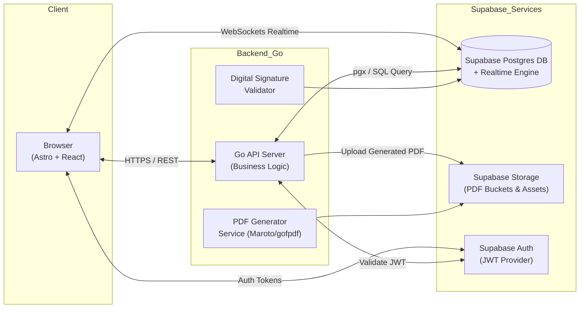
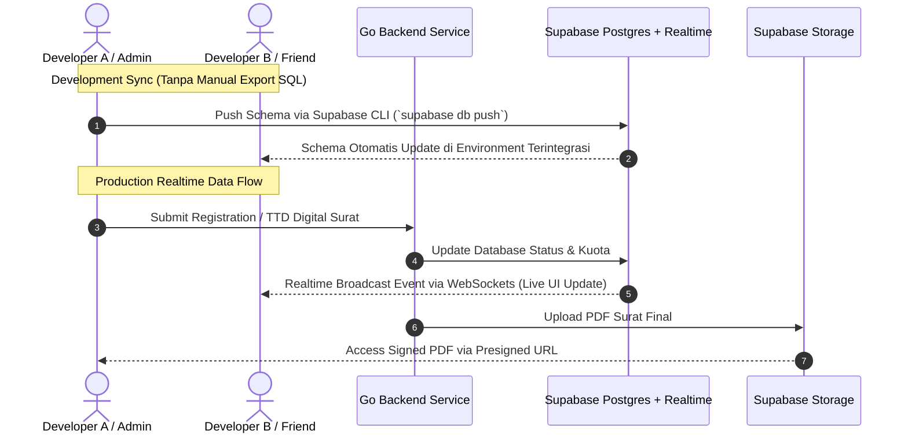

# Product Requirements Document (PRD)
# Website Pendaftaran Penilaian Kompetensi — Puspenkom BKN

| Field           | Detail                                              |
|-----------------|-----------------------------------------------------|
| **Versi**       | 1.0                                                 |
| **Tanggal**     | 28 Agustus 2026                                     |
| **Author**      | Product Management Team                             |
| **Status**      | Draft                                               |
| **Stakeholder** | Puspenkom BKN, Instansi Pemerintah terkait          |

---

## 1. Overview & Objective

### 1.1 Latar Belakang

Pusat Penilaian Kompetensi (Puspenkom) BKN menyelenggarakan berbagai event penilaian kompetensi bagi Aparatur Sipil Negara (ASN). Saat ini, proses pendaftaran peserta dari instansi masih dilakukan secara manual, termasuk pengurusan surat pengantar yang memerlukan cetak fisik dan tanda tangan basah. Hal ini menyebabkan alur kerja yang lambat, rentan kesalahan, dan tidak efisien.

### 1.2 Tujuan Produk

Membangun **Sistem Informasi Pendaftaran Penilaian Kompetensi berbasis web** yang mampu:

1. **Menyederhanakan pendaftaran** — Instansi dapat mendaftarkan stafnya secara online ke event penilaian kompetensi yang tersedia.
2. **Mengotomasi pembuatan surat** — Sistem meng-generate surat pengantar secara otomatis berdasarkan data pendaftaran.
3. **Mendigitalisasi persetujuan** — Proses approval dan tanda tangan dilakukan secara digital (*paperless*), menghilangkan kebutuhan cetak fisik.
4. **Mengelola kuota secara real-time** — Kuota peserta per hari/sesi dikelola otomatis oleh sistem.

### 1.3 Success Metrics

| Metric                          | Target                                                    |
|---------------------------------|-----------------------------------------------------------|
| Waktu pendaftaran end-to-end    | ≤ 3 hari kerja (dari submit hingga status "Diterima")     |
| Adopsi paperless                | 100% surat diproses secara digital                        |
| Akurasi data peserta            | 0% duplikasi NIP dalam satu event                         |
| Uptime sistem                   | ≥ 99.5%                                                   |

---

## 2. User Roles & Permissions

| #  | Role                   | Deskripsi                                                                        | Permissions                                                                                                                                                             |
|----|------------------------|----------------------------------------------------------------------------------|-------------------------------------------------------------------------------------------------------------------------------------------------------------------------|
| 1  | **Admin Puspenkom**    | Staf operasional Puspenkom yang mengelola event dan memverifikasi pendaftaran.    | Membuat, mengedit, menghapus event · Melihat daftar surat masuk · Memverifikasi kesesuaian data pendaftaran · Meneruskan surat ke Kepala Puspenkom · Melihat dashboard & laporan |
| 2  | **Kepala Puspenkom**   | Pimpinan Puspenkom yang memberikan persetujuan akhir.                             | Melihat daftar surat yang sudah diverifikasi Admin · Memberikan tanda tangan digital pada surat · Menolak surat dengan catatan · Melihat dashboard & laporan             |
| 3  | **Admin Instansi**     | Admin instansi pemerintah yang mendaftarkan stafnya.                              | Melihat daftar event · Mendaftarkan staf (manual / upload Excel) · Membagi jadwal staf ke sesi/tanggal · Men-trigger generate surat · Melihat status & mengunduh surat akhir |
| 4  | **Kepala Instansi**    | Pimpinan instansi yang mereview dan menandatangani surat pengajuan.              | Melihat daftar surat pengajuan dari instansinya · Mereview detail surat · Menandatangani surat secara digital · Menolak surat dengan catatan                              |

### 2.1 Matriks Akses Fitur

| Fitur                        | Admin Puspenkom | Kepala Puspenkom | Admin Instansi | Kepala Instansi |
|------------------------------|:---:|:---:|:---:|:---:|
| Kelola Event (CRUD)          | ✅  | ❌  | ❌  | ❌  |
| Lihat Daftar Event           | ✅  | ✅  | ✅  | ✅  |
| Daftarkan Peserta            | ❌  | ❌  | ✅  | ❌  |
| Upload Excel Peserta         | ❌  | ❌  | ✅  | ❌  |
| Bagi Jadwal Peserta          | ❌  | ❌  | ✅  | ❌  |
| Generate Surat               | ❌  | ❌  | ✅  | ❌  |
| Review & TTD Surat (Instansi)| ❌  | ❌  | ❌  | ✅  |
| Verifikasi Surat Masuk       | ✅  | ❌  | ❌  | ❌  |
| TTD Surat (Puspenkom)        | ❌  | ✅  | ❌  | ❌  |
| Download Surat Final         | ✅  | ✅  | ✅  | ✅  |
| Dashboard & Laporan          | ✅  | ✅  | ✅  | ✅  |

---

## 3. User Stories & Acceptance Criteria

### 3.1 Manajemen Event

#### US-01: Membuat Event Penilaian Kompetensi
> **Sebagai** Admin Puspenkom, **saya ingin** membuat event penilaian kompetensi baru, **agar** instansi dapat melihat dan mendaftarkan pesertanya.

| # | Acceptance Criteria |
|---|---------------------|
| 1 | Admin dapat mengisi: Judul Event, Lokasi, Tanggal Mulai & Selesai, Waktu Mulai, Harga (termasuk opsi gratis / Rp 0), dan Kuota Maksimal per hari. |
| 2 | Jika event berlangsung lebih dari 1 hari, sistem otomatis membuat slot sesi untuk setiap hari berdasarkan rentang tanggal. |
| 3 | Validasi: Tanggal mulai tidak boleh di masa lampau, kuota minimal 1, judul wajib diisi. |
| 4 | Event yang berhasil dibuat muncul di daftar event dengan status **"Aktif"**. |
| 5 | Admin dapat mengedit atau menonaktifkan event selama belum memiliki pendaftaran yang berstatus "Diterima". |

#### US-02: Melihat Daftar Event
> **Sebagai** Admin Instansi, **saya ingin** melihat daftar event yang tersedia, **agar** saya dapat memilih event yang sesuai untuk staf saya.

| # | Acceptance Criteria |
|---|---------------------|
| 1 | Daftar event menampilkan: Judul, Lokasi, Tanggal, Harga, dan Sisa Kuota per hari/sesi. |
| 2 | Hanya event dengan status **"Aktif"** dan kuota tersedia yang ditampilkan. |
| 3 | Tersedia filter berdasarkan lokasi, rentang tanggal, dan harga. |

---

### 3.2 Pendaftaran Peserta

#### US-03: Mendaftarkan Staf via Input Manual
> **Sebagai** Admin Instansi, **saya ingin** mendaftarkan staf saya secara manual dari database staf yang ada, **agar** proses pendaftaran lebih akurat.

| # | Acceptance Criteria |
|---|---------------------|
| 1 | Admin Instansi dapat memilih staf dari daftar staf instansinya (pencarian berdasarkan NIP atau Nama). |
| 2 | Data staf yang dipilih (NIP, Nama, Jabatan) otomatis terisi. |
| 3 | Tidak dapat mendaftarkan NIP yang sama dua kali pada event yang sama. |

#### US-04: Mendaftarkan Staf via Upload Excel
> **Sebagai** Admin Instansi, **saya ingin** meng-upload file Excel berisi data staf, **agar** pendaftaran dalam jumlah banyak lebih cepat.

| # | Acceptance Criteria |
|---|---------------------|
| 1 | Sistem menerima file `.xlsx` / `.xls` dengan kolom: **NIP, Nama, Jabatan**. |
| 2 | Sistem menyediakan template Excel yang dapat diunduh. |
| 3 | Setelah upload, sistem menampilkan preview data untuk dikonfirmasi sebelum disimpan. |
| 4 | Jika terdapat baris yang tidak valid (NIP duplikat, kolom kosong), sistem menampilkan daftar error per baris tanpa menggagalkan seluruh upload — baris yang valid tetap dapat disimpan. |
| 5 | Jumlah peserta yang di-upload tidak melebihi sisa kuota event. |

#### US-05: Membagi Jadwal Peserta ke Sesi/Tanggal
> **Sebagai** Admin Instansi, **saya ingin** mendistribusikan staf yang telah didaftarkan ke tanggal/sesi yang berbeda, **agar** jadwal sesuai kebutuhan instansi saya.

| # | Acceptance Criteria |
|---|---------------------|
| 1 | Setelah peserta terdaftar pada suatu event, Admin Instansi melihat daftar sesi/tanggal beserta sisa kuota masing-masing. |
| 2 | Admin Instansi dapat drag-and-drop atau memilih tanggal/sesi untuk setiap peserta. |
| 3 | Sistem mencegah alokasi melebihi kuota harian yang tersedia. |
| 4 | Semua peserta harus teralokasi ke salah satu sesi sebelum dapat melanjutkan ke proses generate surat. |

---

### 3.3 Generate Surat Otomatis ⭐

#### US-06: Generate Surat Pengantar
> **Sebagai** Admin Instansi, **saya ingin** sistem menghasilkan surat pengantar secara otomatis setelah pendaftaran selesai, **agar** saya tidak perlu membuat surat secara manual.

| # | Acceptance Criteria |
|---|---------------------|
| 1 | Tombol "Generate Surat" hanya aktif setelah **semua peserta** telah dialokasikan ke sesi. |
| 2 | Surat yang dihasilkan memuat informasi berikut secara otomatis: |
|   | — Kop Surat Instansi (berdasarkan data instansi) |
|   | — Nomor Surat (auto-generated berdasarkan format penomoran instansi) |
|   | — Perihal: Pengajuan Penilaian Kompetensi |
|   | — Nama Event, Lokasi, dan Waktu Pelaksanaan |
|   | — Harga / Biaya |
|   | — Tabel daftar peserta (NIP, Nama, Jabatan, Tanggal/Sesi yang dipilih) |
|   | — Ruang tanda tangan: **Kepala Instansi** (kiri) dan **Kepala Puspenkom** (kanan) |
| 3 | Surat dihasilkan dalam format yang dapat dipreview di browser (HTML-based) dan diunduh sebagai **PDF**. |
| 4 | Setelah di-generate, surat memiliki status **"Draft — Menunggu TTD Kepala Instansi"**. |
| 5 | Admin Instansi dapat melihat preview surat sebelum mengirimkan ke Kepala Instansi untuk ditandatangani. |
| 6 | Jika terdapat kesalahan, Admin Instansi dapat **membatalkan** dan mengulang proses pendaftaran sebelum surat ditandatangani. |

---

### 3.4 Tanda Tangan Digital ⭐

#### US-07: Tanda Tangan Digital oleh Kepala Instansi (Approval Tahap 1)
> **Sebagai** Kepala Instansi, **saya ingin** menandatangani surat pengajuan secara digital melalui website, **agar** proses approval tidak memerlukan dokumen fisik.

| # | Acceptance Criteria |
|---|---------------------|
| 1 | Kepala Instansi melihat daftar surat pengajuan yang berstatus **"Menunggu TTD Kepala Instansi"** di dashboardnya. |
| 2 | Kepala Instansi dapat membuka dan mereview isi surat (preview lengkap). |
| 3 | Tersedia tombol **"Tanda Tangan Digital"** dan tombol **"Tolak"** (disertai kolom alasan). |
| 4 | Setelah menekan "Tanda Tangan Digital": |
|   | — Sistem meminta konfirmasi (modal dialog) sebelum memproses. |
|   | — Tanda tangan digital (berupa nama, jabatan, dan timestamp) tersemat otomatis pada area tanda tangan **Kepala Instansi** di surat. |
|   | — Status surat berubah menjadi **"Ditandatangani Kepala Instansi — Menunggu Verifikasi Puspenkom"**. |
| 5 | Jika ditolak, status surat menjadi **"Ditolak Kepala Instansi"** dan alasan penolakan terlihat oleh Admin Instansi. |
| 6 | Surat yang sudah ditandatangani oleh Kepala Instansi **tidak dapat diedit** lagi oleh Admin Instansi. |

#### US-08: Verifikasi oleh Admin Puspenkom
> **Sebagai** Admin Puspenkom, **saya ingin** memverifikasi surat yang sudah ditandatangani Kepala Instansi, **agar** data pendaftaran dipastikan sesuai sebelum disetujui Kepala Puspenkom.

| # | Acceptance Criteria |
|---|---------------------|
| 1 | Admin Puspenkom melihat daftar surat masuk berstatus **"Ditandatangani Kepala Instansi"** di dashboardnya. |
| 2 | Admin dapat melihat detail surat, data peserta, dan kesesuaian event (kuota, jadwal). |
| 3 | Tombol **"Teruskan ke Kepala Puspenkom"** untuk menyetujui, dan tombol **"Tolak"** (dengan alasan). |
| 4 | Setelah diteruskan, status berubah menjadi **"Menunggu TTD Kepala Puspenkom"**. |
| 5 | Jika ditolak, status menjadi **"Ditolak Admin Puspenkom"** dan alasan terlihat oleh Admin Instansi. |

#### US-09: Tanda Tangan Digital oleh Kepala Puspenkom (Approval Tahap 2)
> **Sebagai** Kepala Puspenkom, **saya ingin** menandatangani surat pengajuan secara digital, **agar** proses persetujuan akhir berjalan cepat dan tercatat.

| # | Acceptance Criteria |
|---|---------------------|
| 1 | Kepala Puspenkom melihat daftar surat berstatus **"Menunggu TTD Kepala Puspenkom"** di dashboardnya. |
| 2 | Kepala Puspenkom dapat mereview isi surat secara lengkap. |
| 3 | Setelah menekan "Tanda Tangan Digital": |
|   | — Sistem meminta konfirmasi (modal dialog). |
|   | — Tanda tangan digital tersemat otomatis pada area tanda tangan **Kepala Puspenkom** di surat. |
|   | — Status surat berubah menjadi **"Diterima"**. |
|   | — **Kuota peserta pada event otomatis ter-reserve/berkurang** sesuai jumlah peserta yang disetujui, per sesi/hari. |
| 4 | Jika ditolak, status menjadi **"Ditolak Kepala Puspenkom"** dan alasan terlihat oleh Admin Instansi serta Admin Puspenkom. |

#### US-10: Download Surat Final
> **Sebagai** Admin Instansi, **saya ingin** mengunduh surat yang telah lengkap dengan 2 tanda tangan, **agar** saya memiliki arsip resmi.

| # | Acceptance Criteria |
|---|---------------------|
| 1 | Setelah status surat **"Diterima"**, tombol **"Download PDF"** muncul di dashboard Instansi. |
| 2 | File PDF berisi surat lengkap dengan 2 tanda tangan digital (Kepala Instansi & Kepala Puspenkom). |
| 3 | PDF memiliki watermark/metadata yang menandakan keaslian dokumen. |

---

## 4. User Flow / Business Logic

### 4.1 Alur Kerja End-to-End

`mermaid
flowchart TD
    A["1. Admin Puspenkom\nMembuat Event"] --> B["2. Admin Instansi\nMelihat Daftar Event"]
    B --> C["3. Admin Instansi\nMendaftarkan Staf\n(Manual / Upload Excel)"]
    C --> D["4. Admin Instansi\nMembagi Jadwal Peserta\nke Sesi/Tanggal"]
    D --> E["5. Sistem\nGenerate Surat Otomatis"]
    E --> F["6. Kepala Instansi\nReview & TTD Digital\n(Approval Tahap 1)"]
    F -->|Ditolak| C
    F -->|Disetujui| G["7. Admin Puspenkom\nVerifikasi Surat Masuk"]
    G -->|Ditolak| C
    G -->|Diteruskan| H["8. Kepala Puspenkom\nReview & TTD Digital\n(Approval Tahap 2)"]
    H -->|Ditolak| C
    H -->|Disetujui| I["9. Status: DITERIMA\nKuota Otomatis Berkurang"]
    I --> J["10. Instansi\nDownload Surat Final\n(2 TTD Lengkap)"]
```
`
### 4.2 Detail Tahapan
`
#### Tahap 1 — Pembuatan Event
1. **Admin Puspenkom** login ke sistem.
2. Navigasi ke menu **"Kelola Event"** → klik **"Buat Event Baru"**.
3. Mengisi formulir: Judul, Lokasi, Tanggal Mulai, Tanggal Selesai, Waktu Mulai, Harga, Kuota Maksimal per Hari.
4. Sistem memvalidasi input, lalu menyimpan event dengan status **"Aktif"**.
5. Sistem otomatis membuat record sesi untuk setiap hari antara tanggal mulai dan selesai, masing-masing dengan kuota yang telah ditentukan.

#### Tahap 2 — Pendaftaran Peserta
1. **Admin Instansi** login ke sistem.
2. Navigasi ke menu **"Event Tersedia"**, melihat daftar event aktif beserta sisa kuota.
3. Memilih event yang diinginkan, lalu klik **"Daftarkan Peserta"**.
4. Memilih metode input:
   - **Manual**: Mencari staf dari database instansi berdasarkan NIP/Nama, memilih satu per satu.
   - **Upload Excel**: Mengunduh template, mengisi data, lalu meng-upload file `.xlsx`.
5. Sistem memvalidasi data (duplikasi NIP, kelengkapan kolom, kesesuaian kuota).
6. Menampilkan preview daftar peserta yang berhasil divalidasi.
7. Admin Instansi mengkonfirmasi pendaftaran.

#### Tahap 3 — Pembagian Jadwal
1. Setelah peserta terdaftar, sistem menampilkan halaman **"Atur Jadwal"**.
2. Ditampilkan daftar sesi/tanggal event beserta kuota tersisa.
3. Admin Instansi mengalokasikan setiap peserta ke sesi/tanggal tertentu.
4. Sistem memvalidasi alokasi tidak melebihi kuota harian.
5. Semua peserta harus teralokasi sebelum dapat melanjutkan.

#### Tahap 4 — Generate Surat
1. Setelah semua peserta teralokasi, tombol **"Generate Surat"** aktif.
2. Admin Instansi menekan tombol tersebut.
3. Sistem menghasilkan surat berisi: kop surat, nomor surat, perihal, detail event, tabel peserta, dan area 2 tanda tangan.
4. Admin Instansi melihat preview surat.
5. Jika sesuai, Admin Instansi klik **"Kirim ke Kepala Instansi"**.
6. Status surat: **"Menunggu TTD Kepala Instansi"**.

#### Tahap 5 — Approval Tahap 1 (Kepala Instansi)
1. **Kepala Instansi** login, melihat notifikasi surat baru di dashboard.
2. Membuka surat, mereview isi.
3. **Disetujui** → Klik "Tanda Tangan Digital" → Konfirmasi → TTD tersemat → Status: **"Ditandatangani Kepala Instansi"**.
4. **Ditolak** → Klik "Tolak" → Isi alasan → Status: **"Ditolak Kepala Instansi"** → Admin Instansi menerima notifikasi.

#### Tahap 6 — Verifikasi Admin Puspenkom
1. **Admin Puspenkom** melihat surat masuk berstatus **"Ditandatangani Kepala Instansi"**.
2. Memeriksa kesesuaian data pendaftaran (peserta, event, kuota).
3. **Diteruskan** → Status: **"Menunggu TTD Kepala Puspenkom"**.
4. **Ditolak** → Status: **"Ditolak Admin Puspenkom"** → Admin Instansi menerima notifikasi.

#### Tahap 7 — Approval Tahap 2 (Kepala Puspenkom)
1. **Kepala Puspenkom** melihat surat berstatus **"Menunggu TTD Kepala Puspenkom"**.
2. Mereview isi surat.
3. **Disetujui** → Klik "Tanda Tangan Digital" → Konfirmasi → TTD tersemat → Status: **"Diterima"** → **Kuota event berkurang otomatis**.
4. **Ditolak** → Status: **"Ditolak Kepala Puspenkom"** → Notifikasi ke Admin Puspenkom & Admin Instansi.

#### Tahap 8 — Output Akhir
1. Admin Instansi dan Kepala Instansi melihat status **"Diterima"** di dashboard.
2. Tombol **"Download PDF"** aktif.
3. PDF berisi surat lengkap dengan 2 tanda tangan digital (Kepala Instansi & Kepala Puspenkom).

### 4.3 Status Lifecycle Surat

`mermaid
stateDiagram-v2
    [*] --> Draft: Generate Surat
    Draft --> MenungguTTDKepalaInstansi: Kirim ke Kepala Instansi
    MenungguTTDKepalaInstansi --> DitolakKepalaInstansi: Ditolak
    MenungguTTDKepalaInstansi --> DitandatanganiKepalaInstansi: TTD Digital
    DitolakKepalaInstansi --> Draft: Revisi & Regenerate
    DitandatanganiKepalaInstansi --> MenungguVerifikasiPuspenkom: Auto-forward
    MenungguVerifikasiPuspenkom --> DitolakAdminPuspenkom: Ditolak
    MenungguVerifikasiPuspenkom --> MenungguTTDKepalaPuspenkom: Diteruskan
    DitolakAdminPuspenkom --> Draft: Revisi & Regenerate
    MenungguTTDKepalaPuspenkom --> DitolakKepalaPuspenkom: Ditolak
    MenungguTTDKepalaPuspenkom --> Diterima: TTD Digital
    DitolakKepalaPuspenkom --> Draft: Revisi & Regenerate
    Diterima --> [*]
```
`
---
`
## 5. System Architecture & Tech Stack

### 5.1 Tech Stack

| Layer | Teknologi | Keterangan |
|---|---|---|
| **Frontend** | Astro JS + React | SSG/SSR dengan Astro, komponen interaktif menggunakan React (Islands Architecture). |
| **Styling** | Tailwind CSS | Utility-first CSS framework untuk konsistensi dan kecepatan UI. |
| **Backend API** | Golang (Go) | Core REST API untuk logika bisnis utama, validasi kuota harian, PDF generation, & signature processing. |
| **Database & Realtime** | Supabase (PostgreSQL + Realtime) | Managed PostgreSQL DB dengan Supabase Realtime (WebSockets) untuk sinkronisasi data instan antar developer & UI tanpa manual export SQL. |
| **Auth** | Supabase Auth + Go Middleware | Autentikasi terpusat (JWT). Go API memvalidasi token JWT Supabase via middleware RBAC. |
| **PDF Engine** | Go PDF Library | Server-side PDF generation (`gofpdf`, `maroto`, atau `go-wkhtmltopdf`). |
| **Storage** | Supabase Storage | Object Storage terpusat untuk menyimpan file PDF surat hasil generate dan logo kop surat instansi. |
| **Dev Collaboration** | Supabase CLI (`supabase db push`) | Sinkronisasi migrasi database antar tim developer secara otomatis via Git & Supabase CLI (tanpa export `.sql` manual). |

### 5.2 Arsitektur Tingkat Tinggi



### 5.3 Realtime Collaboration & Synchronization Workflow (Developer & Production)



### 5.4 Struktur Folder (High-Level)

```
project-root/
├── frontend/                     # Astro JS Project
│   ├── src/
│   │   ├── components/           # Reusable React components
│   │   ├── layouts/              # Astro layouts
│   │   ├── pages/                # Astro file-based routing
│   │   ├── services/             # API service layer (Supabase Client + Go API)
│   │   └── utils/                # Helper functions
│   └── public/                   # Static assets
│
├── backend/                      # Go Project
│   ├── cmd/
│   │   └── server/               # Entry point
│   ├── internal/
│   │   ├── handler/              # HTTP handlers
│   │   ├── service/              # Business logic
│   │   ├── repository/           # Supabase/Postgres DB queries
│   │   ├── middleware/           # Supabase Auth JWT, CORS
│   │   └── pdf/                  # PDF generation logic
│   └── config/                   # App configuration & Supabase Keys
│
├── supabase/                     # Supabase CLI Infrastructure
│   ├── migrations/               # SQL Migration files (Versioned)
│   ├── seed.sql                  # Initial seed data
│   └── config.toml               # Supabase local config
│
└── docs/                         # Documentation & PRD
```

---

## 6. Data Entities

### 6.1 Entity Relationship Diagram

`mermaid
erDiagram
    USERS ||--o{ REGISTRATIONS : "creates"
    USERS ||--o{ LETTERS : "signs"
    INSTITUTIONS ||--o{ USERS : "has"
    INSTITUTIONS ||--o{ STAFF : "has"
    BKN_REGIONAL_OFFICES ||--o{ EVENTS : "hosts"
    EVENTS ||--o{ EVENT_SESSIONS : "has"
    EVENT_SESSIONS ||--o{ REGISTRATION_PARTICIPANTS : "allocates"
    REGISTRATIONS ||--o{ REGISTRATION_PARTICIPANTS : "contains"
    REGISTRATIONS ||--|| LETTERS : "generates"
    STAFF ||--o{ REGISTRATION_PARTICIPANTS : "participates"
    LETTERS ||--o{ LETTER_SIGNATURES : "has"
    LETTERS ||--o{ LETTER_HISTORY : "tracks"
`
    USERS {
        uuid id PK
        string name
        string email
        string password_hash
        enum role
        uuid institution_id FK
        timestamp created_at
    }

    INSTITUTIONS {
        uuid id PK
        string name
        string code
        string address
        string letterhead_data
        string letter_number_format
        timestamp created_at
    }

    BKN_REGIONAL_OFFICES {
        uuid id PK
        string name
        string address
        timestamp created_at
    }

    STAFF {
        uuid id PK
        string nip
        string name
        string position
        uuid institution_id FK
        timestamp created_at
    }

    EVENTS {
        uuid id PK
        string title
        uuid location_id FK
        date start_date
        date end_date
        time start_time
        decimal price
        enum status
        uuid created_by FK
        timestamp created_at
    }

    EVENT_SESSIONS {
        uuid id PK
        uuid event_id FK
        date session_date
        int max_quota
        int used_quota
    }

    REGISTRATIONS {
        uuid id PK
        uuid event_id FK
        uuid institution_id FK
        uuid created_by FK
        enum status
        timestamp created_at
    }

    REGISTRATION_PARTICIPANTS {
        uuid id PK
        uuid registration_id FK
        uuid staff_id FK
        uuid event_session_id FK
    }

    LETTERS {
        uuid id PK
        uuid registration_id FK
        string letter_number
        text content_html
        string pdf_path
        enum status
        timestamp created_at
        timestamp updated_at
    }

    LETTER_SIGNATURES {
        uuid id PK
        uuid letter_id FK
        uuid signer_id FK
        enum signer_role
        string signature_data
        timestamp signed_at
    }

    LETTER_HISTORY {
        uuid id PK
        uuid letter_id FK
        uuid actor_id FK
        enum action
        text notes
        timestamp created_at
    }
```

### 6.2 Detail Tabel Database

#### `users`
| Kolom          | Tipe          | Constraint     | Keterangan                                        |
|----------------|---------------|----------------|---------------------------------------------------|
| id             | UUID          | PK             | Primary key                                       |
| name           | VARCHAR(255)  | NOT NULL       | Nama lengkap                                      |
| email          | VARCHAR(255)  | UNIQUE, NOT NULL| Email login                                      |
| password_hash  | TEXT          | NOT NULL       | Bcrypt hashed password                            |
| role           | ENUM          | NOT NULL       | `admin_puspenkom`, `kepala_puspenkom`, `admin_instansi`, `kepala_instansi` |
| institution_id | UUID          | FK → institutions | NULL untuk user Puspenkom                      |
| created_at     | TIMESTAMPTZ   | DEFAULT NOW()  |                                                   |
| updated_at     | TIMESTAMPTZ   | DEFAULT NOW()  |                                                   |

#### `institutions`
| Kolom               | Tipe          | Constraint     | Keterangan                                   |
|---------------------|---------------|----------------|----------------------------------------------|
| id                  | UUID          | PK             |                                              |
| name                | VARCHAR(255)  | NOT NULL       | Nama instansi                                |
| code                | VARCHAR(50)   | UNIQUE         | Kode instansi                                |
| address             | TEXT          |                | Alamat instansi                              |
| letterhead_data     | JSONB         |                | Data kop surat (logo, nama, alamat header)   |
| letter_number_format| VARCHAR(100)  |                | Format penomoran surat instansi              |
| created_at          | TIMESTAMPTZ   | DEFAULT NOW()  |                                              |

#### `staff`
| Kolom          | Tipe          | Constraint          | Keterangan                      |
|----------------|---------------|---------------------|---------------------------------|
| id             | UUID          | PK                  |                                 |
| nip            | VARCHAR(18)   | UNIQUE, NOT NULL    | Nomor Induk Pegawai             |
| name           | VARCHAR(255)  | NOT NULL            | Nama pegawai                    |
| position       | VARCHAR(255)  | NOT NULL            | Jabatan                         |
| institution_id | UUID          | FK → institutions   | Instansi pegawai                |
| created_at     | TIMESTAMPTZ   | DEFAULT NOW()       |                                 |

#### `bkn_regional_offices`
| Kolom    | Tipe          | Constraint     | Keterangan                                      |
|----------|---------------|----------------|-------------------------------------------------|
| id       | UUID          | PK             |                                                 |
| name     | VARCHAR(255)  | NOT NULL       | Nama kantor regional (contoh: Kanreg I BKN...)  |
| address  | TEXT          |                | Alamat kantor regional                          |
| created_at | TIMESTAMPTZ | DEFAULT NOW()  |                                                 |

#### `events`
| Kolom       | Tipe          | Constraint     | Keterangan                                        |
|-------------|---------------|----------------|---------------------------------------------------|
| id          | UUID          | PK             |                                                   |
| title       | VARCHAR(255)  | NOT NULL       | Judul event                                       |
| location_id | UUID          | FK → bkn_regional_offices | Referensi ke tabel lokasi BKN Regional |
| start_date  | DATE          | NOT NULL       | Tanggal mulai                                     |
| end_date    | DATE          | NOT NULL       | Tanggal selesai                                   |
| start_time  | TIME          | NOT NULL       | Waktu mulai (jam)                                 |
| price       | DECIMAL(15,2) | DEFAULT 0      | Harga (0 = gratis)                                |
| status      | ENUM          | DEFAULT 'active'| `active`, `inactive`, `completed`                |
| created_by  | UUID          | FK → users     | Admin Puspenkom yang membuat                      |
| created_at  | TIMESTAMPTZ   | DEFAULT NOW()  |                                                   |
| updated_at  | TIMESTAMPTZ   | DEFAULT NOW()  |                                                   |

#### `event_sessions`
| Kolom        | Tipe    | Constraint     | Keterangan                          |
|--------------|---------|----------------|-------------------------------------|
| id           | UUID    | PK             |                                     |
| event_id     | UUID    | FK → events    | Event induk                         |
| session_date | DATE    | NOT NULL       | Tanggal sesi                        |
| max_quota    | INT     | NOT NULL       | Kuota maksimal hari ini             |
| used_quota   | INT     | DEFAULT 0      | Kuota yang sudah terpakai           |

#### `registrations`
| Kolom          | Tipe        | Constraint          | Keterangan                           |
|----------------|-------------|---------------------|--------------------------------------|
| id             | UUID        | PK                  |                                      |
| event_id       | UUID        | FK → events         | Event yang didaftar                  |
| institution_id | UUID        | FK → institutions   | Instansi pendaftar                   |
| created_by     | UUID        | FK → users          | Admin Instansi yang membuat          |
| status         | ENUM        | DEFAULT 'draft'     | `draft`, `submitted`, `approved`, `rejected` |
| created_at     | TIMESTAMPTZ | DEFAULT NOW()       |                                      |

#### `registration_participants`
| Kolom            | Tipe | Constraint                | Keterangan                |
|------------------|------|---------------------------|---------------------------|
| id               | UUID | PK                        |                           |
| registration_id  | UUID | FK → registrations        | Pendaftaran induk         |
| staff_id         | UUID | FK → staff                | Staf yang didaftarkan     |
| event_session_id | UUID | FK → event_sessions       | Sesi/tanggal alokasi      |
| UNIQUE           |      | (registration_id, staff_id) | Cegah duplikasi         |

#### `letters`
| Kolom           | Tipe          | Constraint          | Keterangan                                   |
|-----------------|---------------|---------------------|----------------------------------------------|
| id              | UUID          | PK                  |                                              |
| registration_id | UUID          | FK → registrations, UNIQUE | 1 surat per pendaftaran                |
| letter_number   | VARCHAR(100)  | UNIQUE              | Nomor surat                                  |
| content_html    | TEXT          | NOT NULL            | Konten surat dalam HTML                      |
| pdf_path        | VARCHAR(500)  |                     | Path file PDF                                |
| status          | ENUM          | NOT NULL            | `draft`, `waiting_kepala_instansi`, `signed_kepala_instansi`, `waiting_verification`, `waiting_kepala_puspenkom`, `signed_complete`, `rejected_kepala_instansi`, `rejected_admin_puspenkom`, `rejected_kepala_puspenkom` |
| created_at      | TIMESTAMPTZ   | DEFAULT NOW()       |                                              |
| updated_at      | TIMESTAMPTZ   | DEFAULT NOW()       |                                              |

#### `letter_signatures`
| Kolom          | Tipe        | Constraint       | Keterangan                                         |
|----------------|-------------|------------------|-----------------------------------------------------|
| id             | UUID        | PK               |                                                     |
| letter_id      | UUID        | FK → letters     | Surat yang ditandatangani                           |
| signer_id      | UUID        | FK → users       | User yang menandatangani                            |
| signer_role    | ENUM        | NOT NULL         | `kepala_instansi`, `kepala_puspenkom`               |
| signature_data | TEXT        | NOT NULL         | Data tanda tangan (nama, jabatan, encoded image)    |
| signed_at      | TIMESTAMPTZ | DEFAULT NOW()    | Waktu tanda tangan                                  |

#### `letter_history`
| Kolom      | Tipe        | Constraint    | Keterangan                                                 |
|------------|-------------|---------------|------------------------------------------------------------|
| id         | UUID        | PK            |                                                            |
| letter_id  | UUID        | FK → letters  | Surat terkait                                              |
| actor_id   | UUID        | FK → users    | User yang melakukan aksi                                   |
| action     | ENUM        | NOT NULL      | `created`, `signed`, `forwarded`, `rejected`, `downloaded` |
| notes      | TEXT        |               | Catatan / alasan penolakan                                 |
| created_at | TIMESTAMPTZ | DEFAULT NOW() |                                                            |

---

## 7. Non-Functional Requirements

| Aspek           | Requirement                                                                 |
|-----------------|-----------------------------------------------------------------------------|
| **Performance** | API response time ≤ 500ms untuk operasi umum; PDF generation ≤ 5 detik.    |
| **Security**    | HTTPS wajib; password di-hash (bcrypt); JWT dengan expiry; RBAC ketat; input sanitization; CSRF protection. |
| **Scalability** | Arsitektur mendukung horizontal scaling di backend.                         |
| **Availability**| Target uptime 99.5%; database backup harian.                                |
| **Audit Trail** | Semua aksi kritis tercatat di `letter_history` dan system log.              |
| **Browser**     | Support Chrome, Firefox, Edge (2 versi terakhir).                           |
| **Responsive**  | UI responsif untuk desktop dan tablet (minimum 768px).                      |

---

## 8. Out of Scope (V1)

Berikut fitur-fitur yang **tidak termasuk** dalam scope rilis pertama:

- Integrasi pembayaran online (Upload bukti transfer manual & verifikasi akan dikembangkan di V2 - lihat Bab 10).
- Notifikasi email / push notification (dapat ditambahkan di iterasi berikutnya).
- Integrasi tanda tangan digital berbasis sertifikat (BSrE) — V1 menggunakan tanda tangan digital sederhana (nama, jabatan, timestamp).
- Mobile native application.
- Multi-bahasa (hanya Bahasa Indonesia).
- Reporting & analytics lanjutan (hanya dashboard sederhana).

---

## 9. Milestones & Timeline (Estimasi)

| Phase | Milestone                          | Durasi Estimasi | Deliverable                                    |
|-------|------------------------------------|-----------------|-------------------------------------------------|
| 1     | Setup & Foundation                 | 1 minggu        | Project setup, database schema, auth system     |
| 2     | Event Management                   | 1 minggu        | CRUD event, sesi, kuota                         |
| 3     | Pendaftaran Peserta                | 2 minggu        | Input manual, upload Excel, pembagian jadwal    |
| 4     | Generate Surat & Preview           | 1.5 minggu      | Template surat, auto-generate, preview HTML/PDF |
| 5     | Digital Signature & Approval Flow  | 2 minggu        | TTD digital, approval flow, status management   |
| 6     | Dashboard & Reporting              | 1 minggu        | Dashboard per role, download surat final        |
| 7     | Testing & QA                       | 1.5 minggu      | Unit test, integration test, UAT                |
| 8     | Deployment & Go-Live               | 1 minggu        | Server setup, deployment, monitoring            |
|       | **Total Estimasi**                 | **~11 minggu**  |                                                 |

---

## 10. Future Requirements (V2)

Berdasarkan tinjauan dan diskusi pengembangan, beberapa fitur strategis akan dibangun pada fase V2. Salah satu fokus utama di V2 adalah kelengkapan administrasi pasca-persetujuan:

### 10.1 Modul Verifikasi Pembayaran (V2)
Untuk mengakomodir penyelesaian administrasi PenKom berbayar (PNBP), sistem akan dikembangkan dengan alur berikut:
1. **Upload Bukti Pembayaran (Admin Instansi):** Setelah status surat "Diterima" oleh Kepala Puspenkom (tahap akhir), Admin Instansi akan mendapatkan akses ke menu khusus untuk mengunggah berkas bukti setor/transfer bank.
2. **Validasi Pembayaran (Admin Puspenkom):** Admin Puspenkom akan memiliki submenu baru (contoh: *Validasi Pembayaran*) untuk mengecek bukti transfer yang diunggah.
3. **Status Penyelesaian:** Setelah divalidasi oleh bendahara/Admin Puspenkom, status pendaftaran akan berubah menjadi **"Lunas / Selesai"**, yang akan memicu keluarnya bukti kuitansi atau tanda terima digital secara otomatis.

---

*Dokumen ini bersifat living document dan akan diperbarui sesuai perkembangan proyek.*


